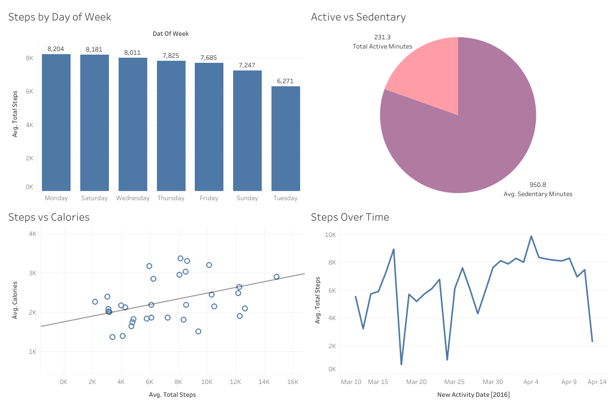

# Bellabeat Fitness Tracker Analysis
### Google Data Analytics Capstone Case Study

**Author:** Kelvin Eki
**Tools used:** Google Sheets, Tableau Public
**Dataset:** [FitBit Fitness Tracker Data (Kaggle)](https://www.kaggle.com/datasets/arashnic/fitbit)

---

## Business Task

Bellabeat is a high-tech wellness company that manufactures health-focused smart products for women. This analysis explores smart device fitness data to identify trends in user activity and provide data-driven recommendations for Bellabeat's marketing strategy.

**Key questions:**
1. What are some trends in smart device usage?
2. How could these trends apply to Bellabeat customers?
3. How could these trends help influence Bellabeat's marketing strategy?

---

## Data Source

This analysis uses the `dailyActivity_merged` dataset from the FitBit Fitness Tracker Data on Kaggle, containing fitness tracker data from 34 users collected between March 12 and April 12, 2016.

**Limitations:**
- Small sample size (34 users)
- Data is from 2016, may not reflect current behavior
- No demographic information (age, gender, location) available

---

## Data Cleaning (Process)

Cleaning was performed in Google Sheets:

- Checked for duplicate entries — none found
- Removed 61 rows with 0 total steps (device not worn)
- Removed 5 rows with calories under 500 (unreliable readings)
- Converted `ActivityDate` from text to proper date format
- Added a `Day of Week` column for trend analysis

**Final cleaned dataset:** 392 rows, 34 unique users, March 12 – April 12, 2016

[View cleaned dataset](#) *(https://docs.google.com/spreadsheets/d/1sSjVzrDCHSZ27OsgjZr7VqeXG2fajNHF0cLAEx21yh8/edit?usp=sharing)*

---

## Analysis & Key Findings

- Users average **7,629 steps/day** — below the recommended 10,000 step target
- Users are sedentary for **951 minutes/day (~66% of the day)**
- Only **19 minutes/day** spent in very active exercise — below the CDC-recommended 30 minutes
- **Monday** is the most active day of the week; **Tuesday** is the least active
- A **moderate positive correlation (r = 0.55)** exists between total steps and calories burned

---

## Visualizations

Dashboard built in Tableau Public:



[View interactive dashboard on Tableau Public](#) *(https://public.tableau.com/app/profile/kelvin.eki7496/viz/BellabeatUserActivityInsights/BellabeatFitnessTrackerAnalysis)*

The dashboard includes:
- Average Steps by Day of Week
- Active vs Sedentary Minutes breakdown
- Steps vs Calories scatter plot with trend line
- Average Steps Over Time

## Recommendations (Act)

**1. Target inactive days with notifications**
Tuesday shows the lowest activity. Bellabeat could send motivational push notifications and step challenges on Tuesdays to help users maintain momentum from Monday.

**2. Promote sedentary alert features**
With users sedentary for ~66% of their day, Bellabeat should prominently market its sedentary alert feature as a tool to break up long periods of inactivity.

**3. Focus on incremental step goals**
Since users average only 76% of the recommended daily steps, the app should encourage incremental goals and celebrate milestones to drive users toward 10,000 steps.

**4. Highlight the steps–calories connection**
The correlation between steps and calories burned can be used in marketing to show the direct health benefit of increasing daily steps.

---

## Tools Used

| Tool | Purpose |
| Google Sheets | Data cleaning and preparation |
| Google Sheets formulas | Statistical analysis (AVERAGE, CORREL, COUNTIF) |
| Tableau Public | Data visualization and dashboard creation |

## Repository Contents

```
bellabeat-case-study/
‚README.md
‚dailyActivity_cleaned.csv
‚Bellabeat Fitness Tracker Analysis.png
